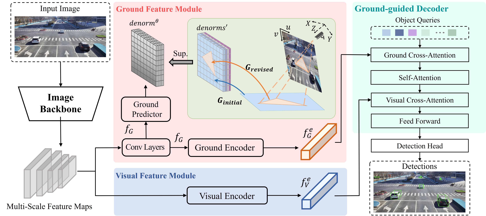

# MonoGAE: Roadside Monocular 3D Object Detection with Ground-Aware Embeddings

## Introduction
MonoGAE is a novel framework for Roadside Monocular 3D object detection with ground-aware embeddings, Specifically, the ground plane is a stable and strong prior knowledge due to the fixed installation of cameras in roadside scenarios. In order to reduce the domain gap between the ground geometry information and high-dimensional image features, we employ a supervised training paradigm with ground plane to predict high-dimensional ground-aware embeddings. These embeddings are subsequently integrated with image features through cross-attention mechanisms. 
<div align="center">
  
</div>


## Docker Image
docker pull yanglei2024/yjx_cuda10-1-1:base

## 根据镜象建立容器：同时容器路径映射为本地目录, 并激活环境
示例：docker run -it --gpus all --shm-size=32g -v /home/yujiaxin:/root --name cuda10-1  181c4354cf77 bash

conda activate monodetr

## Installation
1. Clone this project
    ```
    git clone https://github.com/HIYYJX/MonoGAE.git
    cd MonoGAE
    ```
2. compile the deformable attention:
    ```
    cd lib/models/monodetr/ops/
    bash make.sh
    
    cd ../../../..
    ```
    
3. Make dictionary for saving training losses:
    ```
    mkdir logs
    ```
4. Download [DAIR-V2X-I/single-infrastructure-side](https://thudair.baai.ac.cn/roadtest) 然后根据https://github.com/AIR-THU/DAIR-V2X/blob/main/tools/dataset_converter/dair2kitti.py 将其转换为kitti格式 and prepare the directory structure as:
    ```
    mkdir data
    ```
    ```
    │MonoGAE/
    ├──...
    ├──data/KITTIDataset/
    │   ├──ImageSets/
    |   |   |──test.txt
    |   |   |──train.txt
    |   |   |──trainval.txt
    |   |   |──val.txt
    │   ├──training/
    |   |   |──calib/
    |   |   |   |──000001.txt
    |   |   |   |──......
    |   |   |──denorm/
    |   |   |──image_2/
    |   |   |──label_2/
    |   |   |──velodyne/
    │   ├──testing/
    ├──...
    ```
    其中的training/denorm 是根据 get_denorm.py 获得
    You can also change the data path at "dataset/root_dir" in `configs/monodetr.yaml`.
    

### Train

/GroundDETR/lib/models/monodetr/monodetr.py 中第665行 losses中，'denorms' 意味着地平面方程矩阵编码，'depth_map'  意味着地平面深度图编码,可通过删减'denorms'或者'depth_map' 决定地平面的编码方式
 
You can modify the settings of models and training in `configs/monodetr.yaml` and appoint the GPU in `train.sh`:

    bash train.sh configs/monodetr.yaml > logs/monodetr.log
   
### Test
The best checkpoint will be evaluated as default. You can change it at "tester/checkpoint" in `configs/monodetr.yaml`:

    bash test.sh configs/monodetr.yaml

## Acknowlegment
This repo benefits from the excellent [Deformable-DETR](https://github.com/fundamentalvision/Deformable-DETR) and [MonoDLE](https://github.com/xinzhuma/monodle).

## Citation
```bash
@article{zhang2022monodetr,
  title={MonoDETR: Depth-aware Transformer for Monocular 3D Object Detection},
  author={Zhang, Renrui and Qiu, Han and Wang, Tai and Xu, Xuanzhuo and Guo, Ziyu and Qiao, Yu and Gao, Peng and Li, Hongsheng},
  journal={arXiv preprint arXiv:2203.13310},
  year={2022}
}
```

## Contact
If you have any question about this project, please feel free to contact zhangrenrui@pjlab.org.cn.
